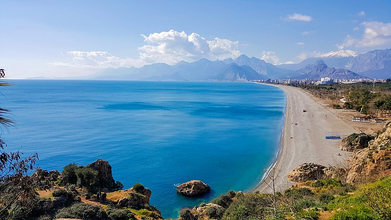
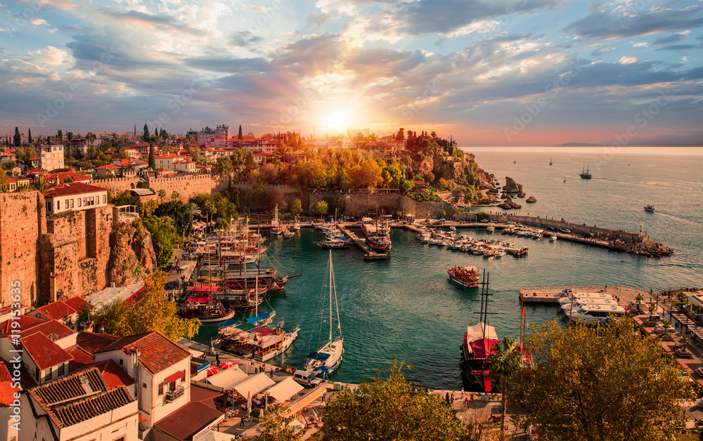
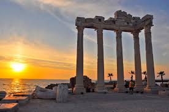
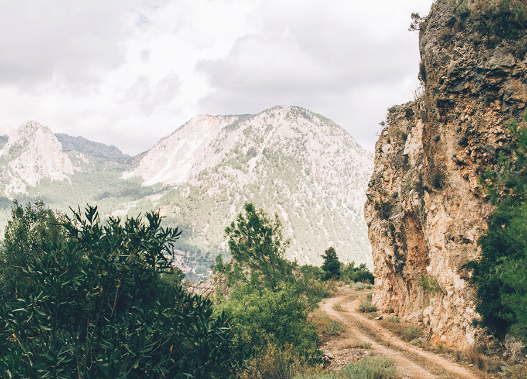
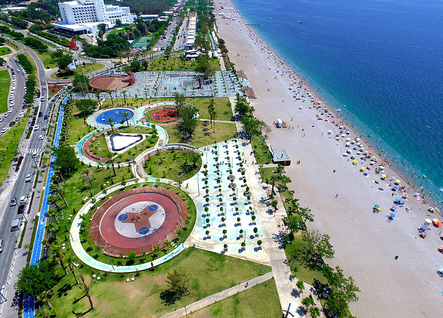

# Discovering Antalya, Turkey: A Mediterranean Gem

Antalya, located on Turkey's stunning southwest coast, is a city where the Mediterranean meets a rich cultural heritage. The moment we landed, we were captivated by the warmth of the local people, the allure of ancient ruins, and the mesmerizing turquoise waters.

## Day 1: Arrival and Exploring the Old Town (Kaleiçi)

The first thing we did after arriving was check into our charming hotel in the Old Town, Kaleiçi. This neighborhood is filled with narrow cobbled streets, historical buildings, and traditional Turkish houses with red-tiled roofs. We spent the day wandering through the labyrinth-like streets, visiting ancient mosques, and stopping at local shops.

We also visited **Hadrian's Gate**, a triumphal arch built to honor the Roman Emperor Hadrian when he visited Antalya. The gate, made of white marble, stands as a testament to the city's Roman history.

## Day 2: Duden Waterfalls and Antalya Museum

On the second day, we took a short trip to the **Duden Waterfalls**, located just outside the city. It was a serene and breathtaking spot, where the water cascades over cliffs into the sea.

In the afternoon, we visited the **Antalya Museum**, which holds one of the largest collections of ancient artifacts in Turkey. The museum is filled with treasures from the Roman and Ottoman empires, giving us a deeper understanding of Antalya's historical significance.

## Day 3: Sun, Sea, and Ancient Ruins in Side

A day trip to **Side**, a nearby ancient city, was next on our list. Side is known for its **Temple of Apollo**, situated right on the water's edge. The ruins of this temple, combined with the views of the sea, were a sight to behold. 

After exploring the ruins, we spent the rest of the day relaxing on the beach. The Mediterranean sun and crystal-clear waters were the perfect way to unwind.

## Day 4: Hiking in the Taurus Mountains

For a change of pace, we headed to the **Taurus Mountains** for a day of hiking. The lush greenery, fresh mountain air, and panoramic views of the coastline were a refreshing contrast to the bustling city. Along the way, we passed by small villages, where locals welcomed us with traditional tea.

## Day 5: Relaxing at Konyaaltı Beach

Our last full day in Antalya was all about relaxation. We spent it lounging at **Konyaaltı Beach**, one of Antalya's most famous beaches. The clear water and smooth pebbles made for a peaceful day by the sea, with the mountains in the background creating a breathtaking view.

## Final Thoughts: A Mediterranean Paradise

Antalya is a place where history and natural beauty come together to create a unique travel experience. Whether you're exploring ancient ruins, hiking through mountains, or soaking up the sun on pristine beaches, this city has something for everyone.

I can’t wait to return to this Mediterranean paradise!
