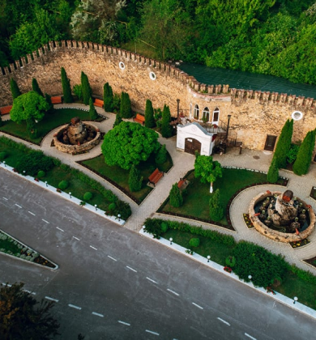
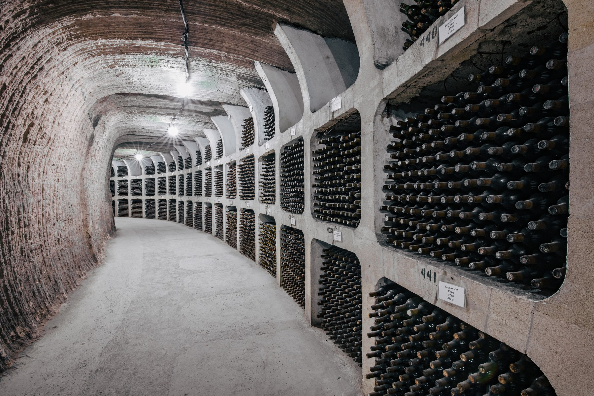
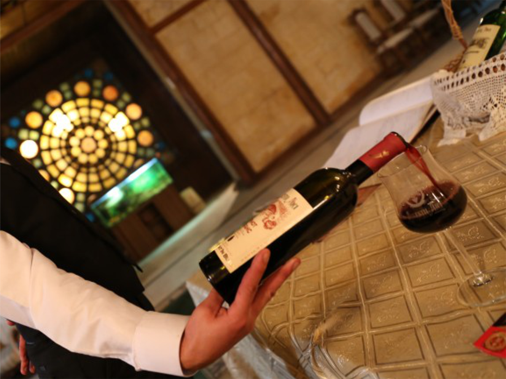
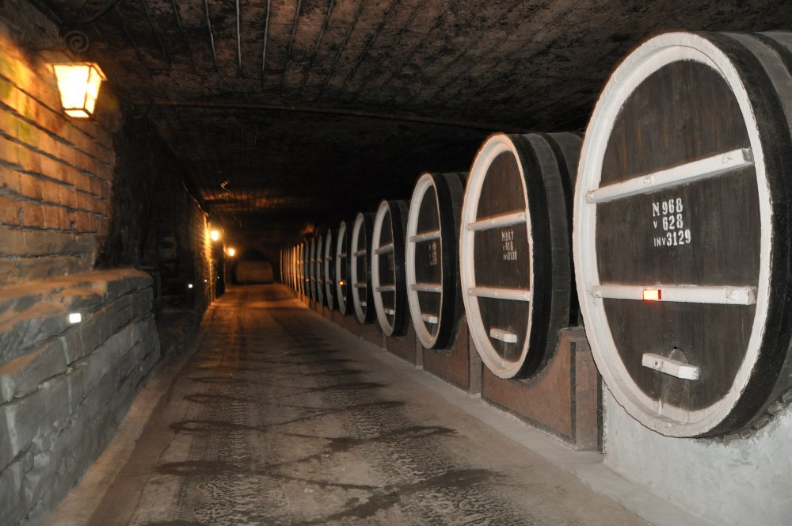
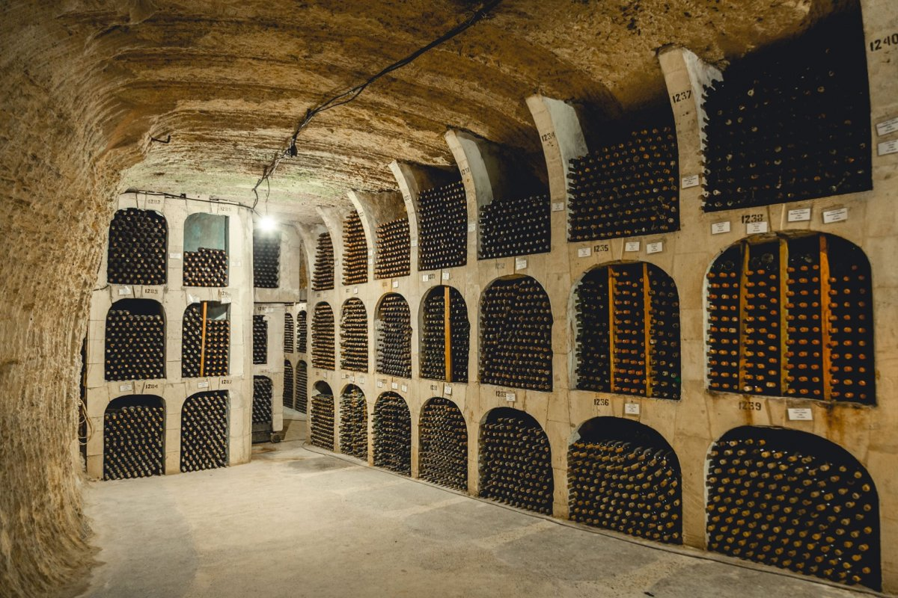

# Discovering Mileștii Mici: A Journey Through the World’s Largest Wine Cellar

Hidden beneath the rolling hills of Moldova, **Mileștii Mici** is a paradise for wine lovers. Known as the largest wine cellar in the world, this underground city of wine holds over 2 million bottles, making it a must-visit for anyone touring this small Eastern European country.

## The Journey to Moldova’s Wine Haven

After arriving in the capital, Chișinău, we were eager to embark on our wine journey. Just a short drive south of the city lies Mileștii Mici. The moment we arrived, the grandeur of this place was apparent—giant limestone caverns carved into the earth stretching for over 200 kilometers, with endless rows of wine barrels and bottles aging to perfection.

We joined a guided tour that took us deep into the cellars. The tunnels, some of which are 85 meters underground, were impressively cool and dimly lit, the perfect environment for aging wine. The scent of oak and aged wine was intoxicating.

## History of Mileștii Mici

Founded in 1969, Mileștii Mici was originally designed as a strategic storage location for Moldova’s booming wine industry. Today, it is home to some of the world’s rarest wines, and it holds the **Guinness World Record** for the largest wine collection.

## The Wine Tasting Experience

After touring the massive underground vaults, we were treated to a **wine tasting session** in one of the winery’s elegant tasting rooms. The experience was incredible. We sampled some of Moldova’s finest vintages, including their **famous Muscat** and rich **Cabernet Sauvignon**.

The wines here are known for their unique flavor, influenced by Moldova’s rich soil and temperate climate. We savored each glass, appreciating the complexity and history behind every bottle.

## Exploring Moldova’s Wine Culture

Our visit to Mileștii Mici was more than just a wine tour—it was an exploration of Moldova’s rich cultural heritage. Moldova has been producing wine for over 5,000 years, making it one of the oldest wine-producing regions in the world. The people here are incredibly proud of their winemaking traditions, and it shows in every glass you drink.

## Day Trips and Nearby Attractions

While Mileștii Mici was undoubtedly the highlight of our trip, we also took the opportunity to explore some nearby attractions. We visited the **Orheiul Vechi Monastery**, a historical site built into the cliffs of the Răut River, offering stunning views and a glimpse into Moldova’s ancient past.

In Chișinău, we wandered through the bustling central market and enjoyed the city’s beautiful parks, making it a perfect complement to our wine adventure.

## Final Thoughts: An Unforgettable Wine Journey

Mileștii Mici is a destination unlike any other. Whether you’re a wine connoisseur or simply a traveler looking for something unique, this underground wine cellar offers an experience that is both enriching and unforgettable. The combination of Moldova’s deep history, breathtaking landscapes, and exceptional wines left a lasting impression on us.

We’ll definitely be back to explore more of Moldova’s hidden gems!

